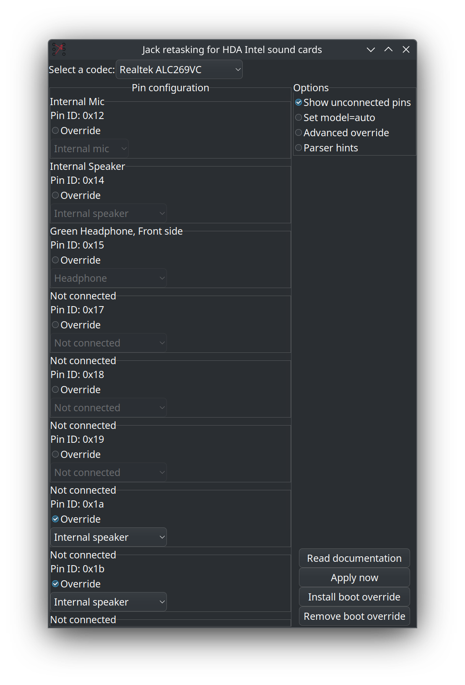

I installed Linux ([EndeavourOS](https://endeavouros.com/)) in my Infinix Air Pro+ last week and noticed that the sound coming from the speakers was bad. This laptops has 4 speakers, hence only 2 of them are working. This is how I fix this issue.

## Check ALSA for Hidden Speakers

```bash
$ cat /proc/asound/card0/codec* | grep -i "node"

State of AFG node 0x01:
Node 0x02 [Audio Output] wcaps 0x41d: Stereo Amp-Out
Node 0x03 [Audio Output] wcaps 0x41d: Stereo Amp-Out
Node 0x04 [Vendor Defined Widget] wcaps 0xf00000: Mono
Node 0x05 [Vendor Defined Widget] wcaps 0xf00000: Mono
Node 0x06 [Audio Output] wcaps 0x611: Stereo Digital
Node 0x07 [Vendor Defined Widget] wcaps 0xf00000: Mono
Node 0x08 [Audio Input] wcaps 0x10051b: Stereo Amp-In
Node 0x09 [Audio Input] wcaps 0x10051b: Stereo Amp-In
Node 0x0a [Vendor Defined Widget] wcaps 0xf00000: Mono
Node 0x0b [Audio Mixer] wcaps 0x20010b: Stereo Amp-In
Node 0x0c [Audio Mixer] wcaps 0x20010b: Stereo Amp-In
Node 0x0d [Audio Mixer] wcaps 0x20010b: Stereo Amp-In
Node 0x0e [Vendor Defined Widget] wcaps 0xf00000: Mono
Node 0x0f [Audio Mixer] wcaps 0x20010a: Mono Amp-In
Node 0x10 [Vendor Defined Widget] wcaps 0xf00000: Mono
Node 0x11 [Vendor Defined Widget] wcaps 0xf00000: Mono
Node 0x12 [Pin Complex] wcaps 0x40040b: Stereo Amp-In
Node 0x13 [Vendor Defined Widget] wcaps 0xf00000: Mono
Node 0x14 [Pin Complex] wcaps 0x40058d: Stereo Amp-Out
Node 0x15 [Pin Complex] wcaps 0x40058d: Stereo Amp-Out
Node 0x16 [Vendor Defined Widget] wcaps 0xf00000: Mono
Node 0x17 [Pin Complex] wcaps 0x40050c: Mono Amp-Out
Node 0x18 [Pin Complex] wcaps 0x40058f: Stereo Amp-In Amp-Out
Node 0x19 [Pin Complex] wcaps 0x40058f: Stereo Amp-In Amp-Out
Node 0x1a [Pin Complex] wcaps 0x40058f: Stereo Amp-In Amp-Out
Node 0x1b [Pin Complex] wcaps 0x40058f: Stereo Amp-In Amp-Out
Node 0x1c [Vendor Defined Widget] wcaps 0xf00000: Mono
Node 0x1d [Pin Complex] wcaps 0x400400: Mono
Node 0x1e [Pin Complex] wcaps 0x400781: Stereo Digital
Node 0x1f [Vendor Defined Widget] wcaps 0xf00000: Mono
Node 0x20 [Vendor Defined Widget] wcaps 0xf00040: Mono
Node 0x21 [Vendor Defined Widget] wcaps 0xf00000: Mono
Node 0x22 [Audio Mixer] wcaps 0x20010b: Stereo Amp-In
Node 0x23 [Audio Mixer] wcaps 0x20010b: Stereo Amp-In
State of AFG node 0x01:
Node 0x03 [Audio Output] wcaps 0x6611: 8-Channels Digital
Node 0x04 [Pin Complex] wcaps 0x40778d: 8-Channels Digital Amp-Out CP
Node 0x05 [Audio Output] wcaps 0x6611: 8-Channels Digital
Node 0x06 [Pin Complex] wcaps 0x40778d: 8-Channels Digital Amp-Out CP
Node 0x07 [Audio Output] wcaps 0x6611: 8-Channels Digital
Node 0x08 [Pin Complex] wcaps 0x40778d: 8-Channels Digital Amp-Out CP
Node 0x09 [Audio Output] wcaps 0x6611: 8-Channels Digital
Node 0x0a [Pin Complex] wcaps 0x40778d: 8-Channels Digital Amp-Out CP
Node 0x0b [Pin Complex] wcaps 0x40778d: 8-Channels Digital Amp-Out CP
Node 0x0c [Pin Complex] wcaps 0x40778d: 8-Channels Digital Amp-Out CP
Node 0x0d [Pin Complex] wcaps 0x40778d: 8-Channels Digital Amp-Out CP
Node 0x0e [Pin Complex] wcaps 0x40778d: 8-Channels Digital Amp-Out CP
Node 0x0f [Pin Complex] wcaps 0x40778d: 8-Channels Digital Amp-Out CP
```

Looking at that output, it seems that this laptop has several nodes that could be an audio output. They are nodes with `Stereo Amp-In Amp-Out` in it's description. Filtering the result with that, I got:

- 0x14 - Stereo Amp-Out (I suspect this is the front speakers that are working)
- 0x15 - Stereo Amp-Out (likely another speakers?)
- 0x18, 0x19, 0x1a, 0x1b - Stereo Amp-In Amp-Out (might be extra speaker outputs)

## Enable Additional Speakers with `hdajackretask`

`hdajackretask` is a tool from ALSA that allow us to remap/retask those nodes/jack into different purposes.

```bash
$ sudo pacman -S alsa-tools
$ sudo hdajackretask
```

After opening the tool, check the `Show unconnected pins` and there will be list of nodes that can be retasked. 
I need to experiment with this remapping. After trials and errors, I found that `0x1a` and `0x1b` is the responsible nodes for my extra speakers. Overriding them and changing their role as `Internal Speaker` solve my issue. 



Now all my speakers is working! I hope this will help someone in the future.
